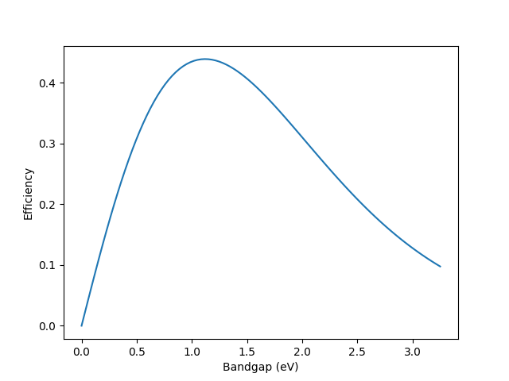

=======================================================
ibei - Calculator for incomplete Bose-Einstein integral
=======================================================

The Bose-Einstein integral appears when calculating quantities
pertaining to photons. It is used to derive the Stefan-Boltzmann law,
and it also appears when calculating the detailed balance limit of a
solar cell as described by Shockley and
Queisser :cite:`10.1063/1.1736034` , but also when calculating the
photo-enhanced thermoelectron emission from a material first
described by Schwede et.al. :cite:`10.1038/nmat2814` .

The :mod:`ibei` module provides functionality to calculate various
forms of the Bose-Einstein integral, along with well-known models of
photovoltaic devices. See the
`Mathematical Description and Applications`_ section for the
mathematical details. The :mod:`ibei` module provides a 
:class:`ibei.BEI` class which includes methods to compute the full,
upper-incomplete, and lower-incomplete Bose-Einstein integrals. It
also includes two convenience classes for calculating the power
density and efficiency of a single-junction solar cell according to
Shockley and Queisser :cite:`10.1063/1.1736034` and
deVos :cite:`9780198513926`.

Installation
------------
This package is installable via ``pip``.

.. code-block:: bash

    pip install ibei

Alternatively, download the source, install
`hatch <https://hatch.pypa.io/latest>`_ and build.

.. code-block:: bash

    git clone git@github.com:jrsmith3/ibei.git
    pip install hatch
    hatch build
    pip install dist/ibei-1.0.6.tar.gz

Examples
--------
Calculate the number of above-bandgap photons from Si at 300K:

    >>> import ibei
    >>> bandgap = 1.1
    >>> bei = ibei.BEI(order=2, energy_bound=bandgap, temperature=300., chemical_potential=0.)
    <Quantity 10549124.09538381 1 / (m2 s)>

Verify Shockley and Queisser's result :cite:`10.1063/1.1736034` that
the efficiency of a silicon solar cell is 44%::

    >>> import ibei
    >>> solarcell = ibei.SQSolarcell(solar_temperature=6000., bandgap=1.1)
    >>> solarcell.efficiency()
    <Quantity 0.43866807>

Plot efficiency vs. bandgap of a single-junction solar cell as in
Shockley and Queisser's Fig. 3 :cite:`10.1063/1.1736034`::

    >>> import ibei
    >>> import numpy as np
    >>> import matplotlib.pyplot as plt

    >>> bandgaps = np.linspace(0, 3.25, 100)
    >>> efficiencies = []
    >>> for bandgap in bandgaps:
    ...     solarcell = ibei.SQSolarcell(solar_temperature=6000, bandgap=bandgap)
    ...     efficiency = solarcell.efficiency()
    ...     efficiencies.append(efficiency)

    >>> plt.plot(bandgaps, efficiencies)
    >>> plt.xlabel("Bandgap (eV)")
    >>> plt.ylabel("Efficiency")
    >>> plt.show()

  Efficiency vs. bandgap of a photovoltaic using Shockley and Queisser's model :cite:`10.1063/1.1736034`.

API Reference
-------------
.. toctree::

    api

Mathematical Description and Applications
-----------------------------------------
The Bose-Einstein integral, subsequently referred to as the "full
Bose-Einstein integral" or "full integral", is denoted
:math:`G_{m} (T, \mu)` and is given by Eq. :eq:`eq:01`.

.. math:: 
    G_{m}(T, \mu) = \frac{2 \pi}{h^{3} c^{2}} \int_{0}^{\infty} E^{m} \frac{1}{\exp(\frac{E-\mu}{kT}) - 1} dE
    :label: eq:01

The quantity :math:`h` is Planck's constant, :math:`c` is the speed of
light, :math:`\mu` is the chemical potential of photons, :math:`E` is
the energy of photons, :math:`T` is the temperature of the radiator,
and :math:`k` is Boltzmann's constant. 

Now consider the two integrals :math:`G_{m} (E_{g}, T, \mu)`
and :math:`g_{m} (E_{g}, T, \mu)`, called the upper-incomplete
Bose-Einstein integral and the lower-incomplete Bose-Einstein
integral, respectively, and given by Eqs. :eq:`eq:02` and
:eq:`eq:03`, respectively.

.. math::
    G_{m} (E_{g}, T, \mu) = \frac{2 \pi}{h^{3} c^{2}} \int_{E_{g}}^{\infty} E^{m} \frac{1}{\exp(\frac{E-\mu}{kT}) - 1} dE
    :label: eq:02

.. math::
    g_{m} (E_{g}, T, \mu) = \frac{2 \pi}{h^{3} c^{2}} \int_{0}^{E_{g}} E^{m} \frac{1}{\exp(\frac{E-\mu}{kT}) - 1} dE
    :label: eq:03

The two integrals given above can be summed to form a relationship
between the full, upper-incomplete, and lower-incomplete
Bose-Einstein integrals.

.. math::
    G_{m} (T, \mu) = G_{m} (E_{g}, T, \mu) + g_{m} (E_{g}, T, \mu)
    :label: eq:04

The integration of the full Bose-Einstein integral can be performed to
yield the expression given in Eq. :eq:`eq:05`.

.. math::
    G_{m}(T, \mu) = \frac{2 \pi (kT)^{m+1}}{h^{3} c^{2}} \Gamma(m+1) Li_{m+1}\left(\exp\left(\frac{\mu}{kT}\right)\right)
    :label: eq:05

where :math:`\Gamma(z)` is the gamma function and
:math:`Li_{s}(z)` is the polylogarithm of index :math:`s`. The
upper-incomplete Bose-Einstein integral can be expressed as a finite
sum of polylogarithm functions as shown by Smith (reference
forthcoming) and given in Eq. :eq:`eq:06`.

.. math::
    G_{m}(E_{A},T,\mu) = \frac{2\pi m! (kT)^{m+1}}{h^{3} c^{2}} \sum_{s = 1}^{m+1} \frac{1}{(m-s+1)!} \left( \frac{E_{A}}{kT} \right)^{m-s+1} Li_{s} \left( \exp \left( \frac{\mu - E_{A}}{kT} \right) \right)
    :label: eq:06

An expression for the lower-incomplete Bose-Einstein integral can be
obtained by solving Eq. :eq:`eq:04` for :math:`g_{m} (E_{g}, T, \mu)`
and substituting Eqs. :eq:`eq:05` and :eq:`eq:06` for the full and
upper-incomplete integrals, respectively.

License
-------
The code is licensed under the
`MIT license <http://opensource.org/licenses/MIT>`_. You can use this
code in your project without telling me, but it would be great to hear
about who's using the code. You can reach me at
joshua.r.smith@gmail.com.

Contributing
------------
The repository is hosted on
`github <https://github.com/jrsmith3/ibei>`_ . Feel free to fork this
project and/or submit a pull request. Please notify me of any issues
using the `issue tracker <https://github.com/jrsmith3/ibei/issues>`_ .

In the unlikely event that a community forms around this project,
please adhere to the
`Python Community code of conduct <https://www.python.org/psf/codeofconduct/>`_.

Version numbers follow the
`PEP440 <https://www.python.org/dev/peps/pep-0440/>`_ rubric. Versions
will have three components: major.minor.patch. These components can
be understood within the `semver <http://semver.org/>`_ rubric.

Citing
------
TBD

Bibliography
------------
.. bibliography:: bib.bib
